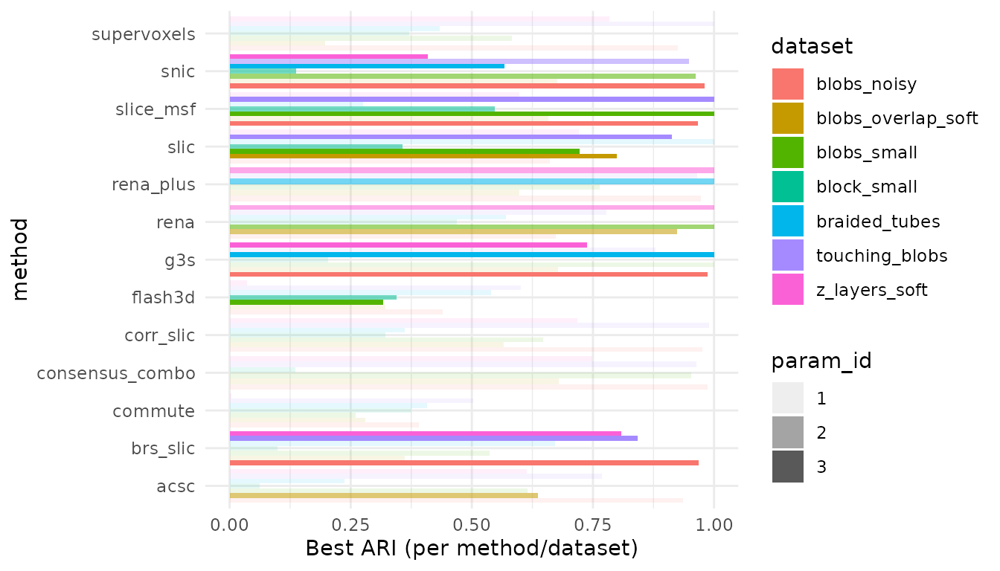
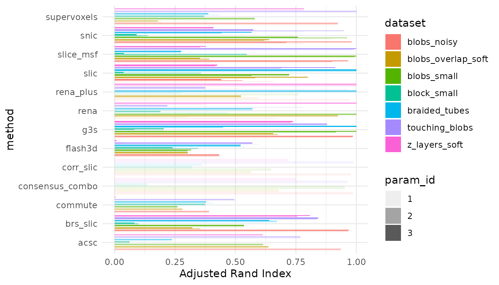
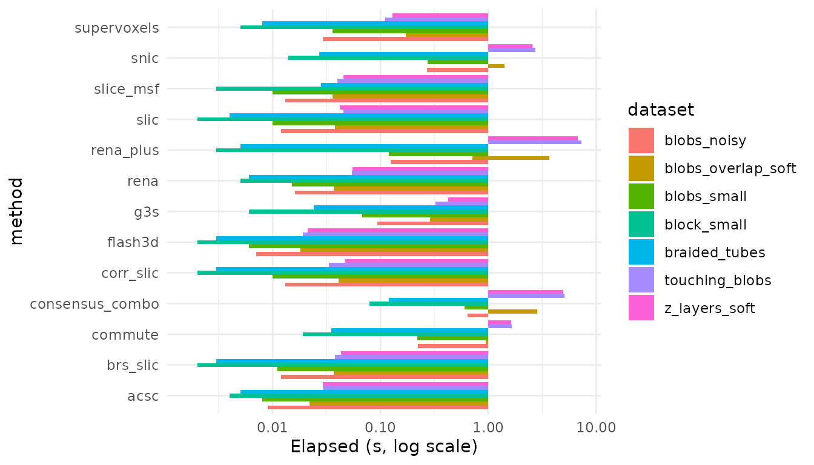
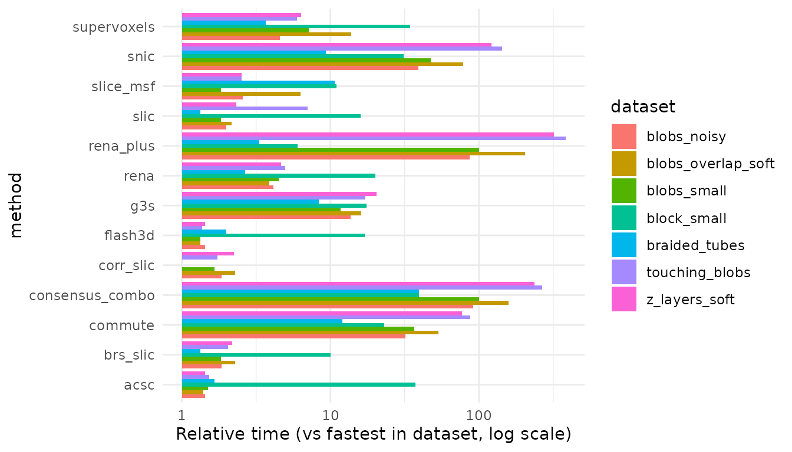
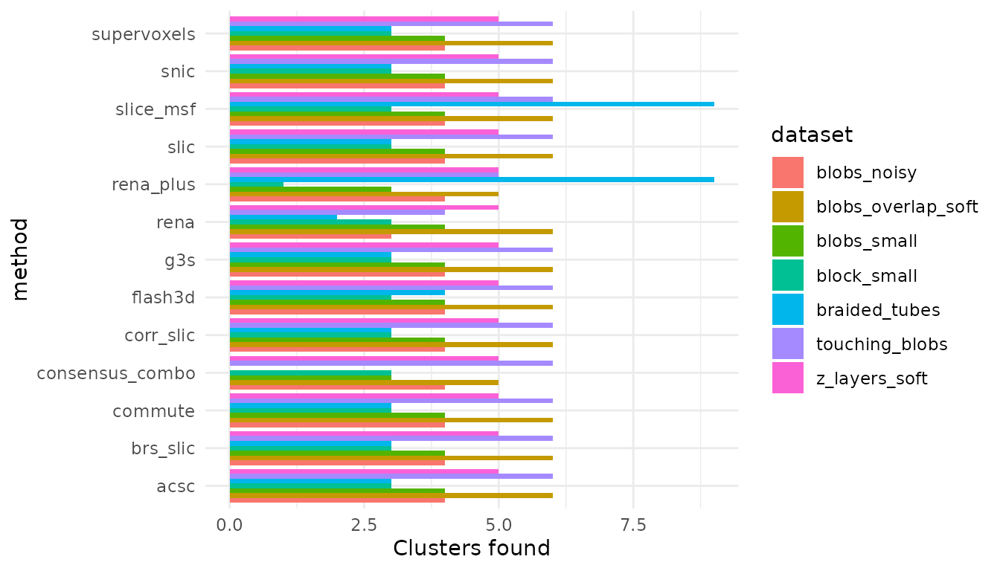

# Benchmark gallery

## What’s in here

- Benchmarks of the core methods (snic, slice_msf, supervoxels, flash3d,
  rena, acsc)
- Shared synthetic datasets of increasing size/complexity
- A few common parameter settings per method to show how runtime and
  cluster count move

The heavy lifting is done by `inst/benchmarks/bench_methods.R`. We keep
that **off by default** so the vignette stays light; instead we read
precomputed results if they exist.

## How to reproduce locally

``` r
# from the package root
Rscript inst/benchmarks/bench_methods.R
```

This writes `inst/benchmarks/results.csv`. Re-knit this vignette to
refresh the tables/plots.

## Load results (if available)

``` r

res_path <- system.file("benchmarks/results.csv", package = "neurocluster")
if (!file.exists(res_path)) {
  cat("Benchmark results not found. Run inst/benchmarks/bench_methods.R to generate them.")
  has_results <- FALSE
} else {
  results <- read.csv(res_path, stringsAsFactors = FALSE)
  results$elapsed_sec <- as.numeric(results$elapsed_sec)
  has_results <- TRUE
}
```

## Summary table

    #>        dataset n_vox n_time      method param_id
    #> 1  block_small   144     80        snic        1
    #> 2  block_small   144     80        snic        2
    #> 3  block_small   144     80        snic        3
    #> 4  block_small   144     80   slice_msf        1
    #> 5  block_small   144     80   slice_msf        2
    #> 6  block_small   144     80   slice_msf        3
    #> 7  block_small   144     80 supervoxels        1
    #> 8  block_small   144     80 supervoxels        2
    #> 9  block_small   144     80     flash3d        1
    #> 10 block_small   144     80     flash3d        2
    #> 11 block_small   144     80     flash3d        3
    #> 12 block_small   144     80        slic        1
    #>                                                                                                           params
    #> 1                                                                                     param_id 1;compactness 1.5
    #> 2                                                                                       param_id 2;compactness 3
    #> 3                                                                                     param_id 3;compactness 0.8
    #> 4  param_id 1;r 12;min_size 2;compactness 2.5;gamma 1;nbhd 8;z_mult 0.5;stitch_z TRUE;num_runs 1;consensus FALSE
    #> 5   param_id 2;r 8;min_size 2;compactness 1.5;gamma 1;nbhd 8;z_mult 0.5;stitch_z TRUE;num_runs 1;consensus FALSE
    #> 6    param_id 3;r 12;min_size 2;compactness 2.5;gamma 1;nbhd 4;z_mult 0;stitch_z TRUE;num_runs 1;consensus FALSE
    #> 7                       param_id 1;alpha 0.3;iterations 30;sigma1 1;sigma2 1.8;use_gradient FALSE;connectivity 6
    #> 8                        param_id 2;alpha 0.4;iterations 30;sigma1 1;sigma2 2;use_gradient FALSE;connectivity 18
    #> 9                                                    param_id 1;dctM 8;lambda_t 1;lambda_s 0.15;bits 64;rounds 2
    #> 10                                                param_id 2;dctM 16;lambda_t 1.4;lambda_s 0.35;bits 64;rounds 4
    #> 11                                                param_id 3;dctM 16;lambda_t 1.4;lambda_s 0.25;bits 64;rounds 4
    #> 12                                                                 param_id 1;spatial_weight 0.1;connectivity 26
    #>    elapsed_sec n_clusters        ari error
    #> 1        0.032          3 0.10867156  <NA>
    #> 2        0.062          3 0.13716840  <NA>
    #> 3        0.014          3 0.09154775  <NA>
    #> 4        0.003          3 0.14257445  <NA>
    #> 5        0.022          3 0.54805333  <NA>
    #> 6        0.003          3 0.03960234  <NA>
    #> 7        0.005          3 0.37124162  <NA>
    #> 8        0.069          3 0.37124162  <NA>
    #> 9        0.002          3 0.26052888  <NA>
    #> 10       0.034          3 0.34428091  <NA>
    #> 11       0.003          3 0.23977585  <NA>
    #> 12       0.002          3 0.03690433  <NA>

## Quick plots



## Notes on parameters

- **snic**: compactness = {2, 5}
- **slice_msf**: r = {8, 12}, min_size tuned for small/medium data
- **supervoxels**: alpha = {0.4, 0.8}
- **flash3d**: dctM = {8, 12}
- **rena**: connectivity = {6, 26}
- **acsc**: lambda = {0.6, 1.0}

These are not exhaustive sweeps—just representative settings to show
trends without long runtimes. Adjust `inst/benchmarks/bench_methods.R`
if you want deeper dives.
