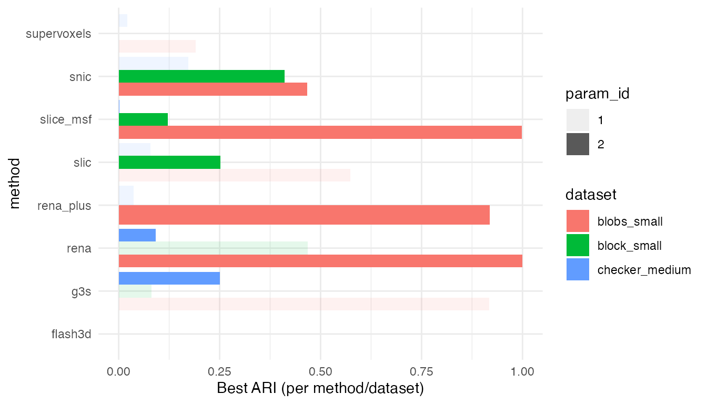
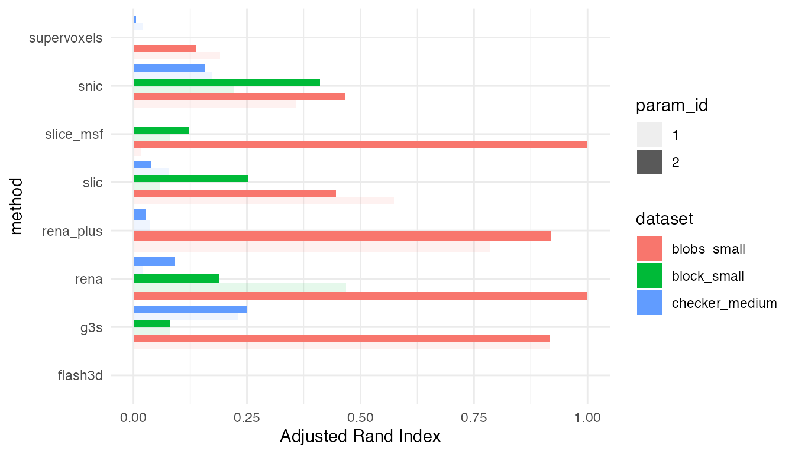
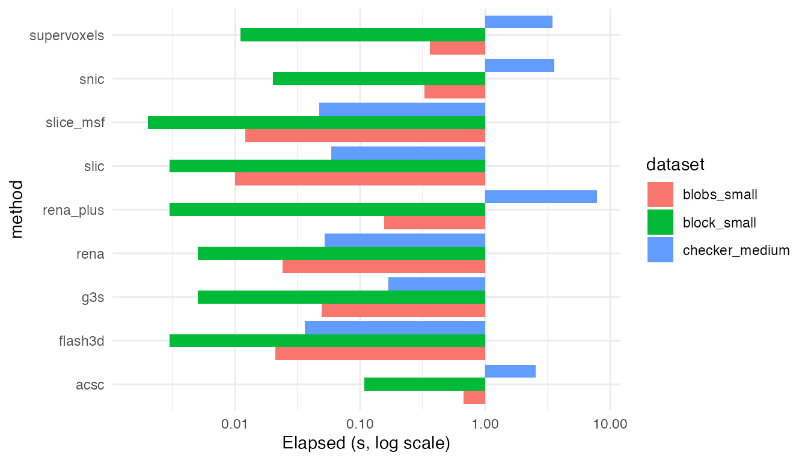
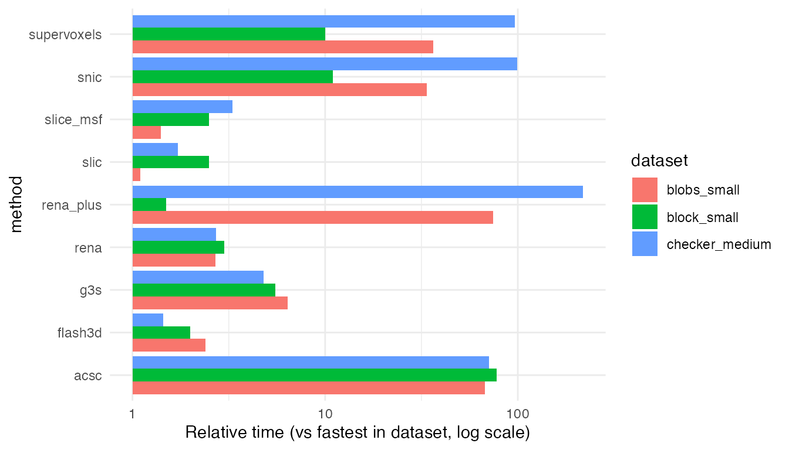
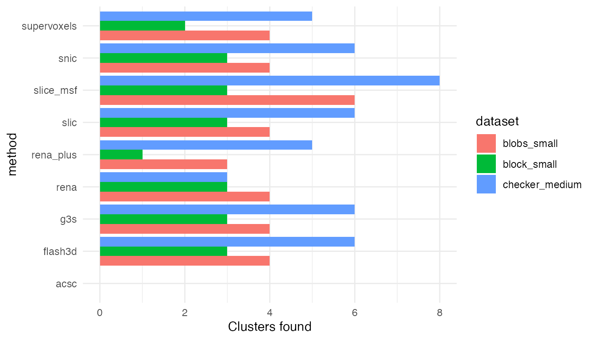

# Benchmark gallery

## What’s in here

- Benchmarks of the core methods (snic, slice_msf, supervoxels, flash3d,
  rena, acsc)
- Shared synthetic datasets of increasing size/complexity
- A few common parameter settings per method to show how runtime and
  cluster count move

The heavy lifting is done by `inst/benchmarks/bench_methods.R`. We keep
that **off by default** so the vignette stays light; instead we read
precomputed results if they exist.

## How to reproduce locally

``` r
# from the package root
Rscript inst/benchmarks/bench_methods.R
```

This writes `inst/benchmarks/results.csv`. Re-knit this vignette to
refresh the tables/plots.

## Load results (if available)

``` r
res_path <- system.file("benchmarks/results.csv", package = "neurocluster")
if (!file.exists(res_path)) {
  cat("Benchmark results not found. Run inst/benchmarks/bench_methods.R to generate them.")
  has_results <- FALSE
} else {
  results <- read.csv(res_path, stringsAsFactors = FALSE)
  results$elapsed_sec <- as.numeric(results$elapsed_sec)
  has_results <- TRUE
}
```

## Summary table

    #>        dataset n_vox n_time      method param_id
    #> 1  block_small   144     80        snic        1
    #> 2  block_small   144     80        snic        2
    #> 3  block_small   144     80   slice_msf        1
    #> 4  block_small   144     80   slice_msf        2
    #> 5  block_small   144     80 supervoxels        1
    #> 6  block_small   144     80 supervoxels        2
    #> 7  block_small   144     80     flash3d        1
    #> 8  block_small   144     80     flash3d        2
    #> 9  block_small   144     80        slic        1
    #> 10 block_small   144     80        slic        2
    #> 11 block_small   144     80         g3s        1
    #> 12 block_small   144     80         g3s        2
    #>                                                     params elapsed_sec
    #> 1                                 param_id 1;compactness 2       0.022
    #> 2                                 param_id 2;compactness 5       0.020
    #> 3   param_id 1;r 8;min_size 6;compactness 3;stitch_z FALSE       0.002
    #> 4  param_id 2;r 12;min_size 10;compactness 4;stitch_z TRUE       0.005
    #> 5                                     param_id 1;alpha 0.4       0.020
    #> 6                                     param_id 2;alpha 0.8       0.011
    #> 7                                        param_id 1;dctM 8       0.004
    #> 8                                       param_id 2;dctM 12       0.003
    #> 9            param_id 1;spatial_weight 0.2;connectivity 26       0.005
    #> 10           param_id 2;spatial_weight 0.4;connectivity 26       0.003
    #> 11                           param_id 1;spatial_weight 0.3       0.011
    #> 12                           param_id 2;spatial_weight 0.6       0.005
    #>    n_clusters          ari error
    #> 1           3 2.209404e-01  <NA>
    #> 2           3 4.107969e-01  <NA>
    #> 3           3 8.073789e-02  <NA>
    #> 4           3 1.210662e-01  <NA>
    #> 5           2 0.000000e+00  <NA>
    #> 6           2 3.940482e-04  <NA>
    #> 7           3 3.276145e-04  <NA>
    #> 8           3 4.308359e-05  <NA>
    #> 9           3 5.957068e-02  <NA>
    #> 10          3 2.518377e-01  <NA>
    #> 11          3 8.129851e-02  <NA>
    #> 12          3 8.129851e-02  <NA>

## Quick plots



## Notes on parameters

- **snic**: compactness = {2, 5}
- **slice_msf**: r = {8, 12}, min_size tuned for small/medium data
- **supervoxels**: alpha = {0.4, 0.8}
- **flash3d**: dctM = {8, 12}
- **rena**: connectivity = {6, 26}
- **acsc**: lambda = {0.6, 1.0}

These are not exhaustive sweeps—just representative settings to show
trends without long runtimes. Adjust `inst/benchmarks/bench_methods.R`
if you want deeper dives.
